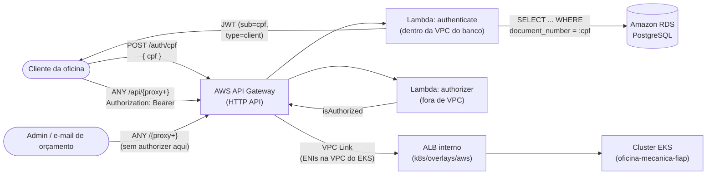
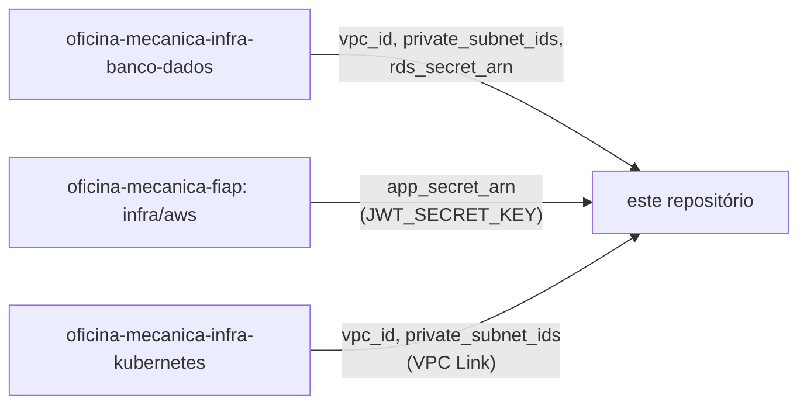

# oficina-mecanica-lambda-auth

Function Serverless (AWS Lambda) de **autenticação via CPF** do sistema de gestão de oficina mecânica — repositório 1 dos 4 exigidos pela Fase 3 do Tech Challenge (SOAT/FIAP).

Valida o CPF informado pelo cliente, consulta a existência do cliente no banco de dados gerenciado (RDS PostgreSQL, provisionado pelo repositório [`oficina-mecanica-infra-banco-dados`](https://github.com/phantosmia/oficina-mecanica-infra-banco-dados)) e emite um **JWT** compatível com o mecanismo de autenticação já usado pela [aplicação principal](https://github.com/phantosmia/oficina-mecanica-fiap) (`app/shared/security.py`), consumível como `Authorization: Bearer <token>` nas rotas protegidas.

Essa decisão de arquitetura está documentada no repositório da aplicação principal:

- [RFC-0004 — Escolha da solução de API Gateway](https://github.com/phantosmia/oficina-mecanica-fiap/blob/main/docs/rfcs/0004-escolha-do-api-gateway.md)
- [ADR-0004 — API Gateway como ponto único de entrada e autorização](https://github.com/phantosmia/oficina-mecanica-fiap/blob/main/docs/adrs/0004-api-gateway-como-ponto-de-entrada.md)
- [ADR-0005 — Lambda de autenticação na VPC do banco de dados](https://github.com/phantosmia/oficina-mecanica-fiap/blob/main/docs/adrs/0005-lambda-auth-na-vpc-do-banco.md)
- [ADR-0006 — ALB interno + VPC Link como único ponto de entrada público](https://github.com/phantosmia/oficina-mecanica-fiap/blob/main/docs/adrs/0006-alb-interno-vpc-link.md)

## Arquitetura



O ALB da aplicação principal é **interno** (não internet-facing, [ADR-0006](https://github.com/phantosmia/oficina-mecanica-fiap/blob/main/docs/adrs/0006-alb-interno-vpc-link.md)) — este API Gateway é o **único** caminho de entrada público, alcançando-o via **VPC Link**. Isso fecha uma lacuna real: antes, qualquer rota "protegida" pelo Lambda Authorizer podia ser contornada batendo direto no ALB, que era público.

Duas funções Lambda, empacotadas a partir do mesmo código (`src/`), com responsabilidades e necessidades de rede diferentes:

| Função | Handler | Rede | Faz o quê |
|---|---|---|---|
| `authenticate` | `handler.authenticate_handler` | Dentro da VPC do banco (`oficina-mecanica-infra-banco-dados`) | Valida o CPF, consulta `clients` no RDS, emite o JWT |
| `authorizer` | `handler.authorizer_handler` | Fora de VPC | Lambda Authorizer (`REQUEST`, respostas simples) do API Gateway — valida o JWT em rotas protegidas |

## Tecnologias

- Python 3.12 (runtime AWS Lambda)
- [PyJWT](https://pyjwt.readthedocs.io/) — emissão/validação do JWT (compatível com `python-jose`, usado pela aplicação principal, para tokens HS256)
- [pg8000](https://github.com/tlocke/pg8000) — driver PostgreSQL 100% Python (sem extensão C, evita o problema de compilar `psycopg2` para o runtime do Lambda)
- AWS API Gateway (HTTP API) + Lambda Authorizer
- Terraform >= 1.6
- GitHub Actions

## Estrutura do repositório

```text
src/
  handler.py       # entrypoints: authenticate_handler, authorizer_handler
  cpf.py           # validação de CPF (sem dependências externas)
  db.py            # consulta a clients no RDS via pg8000
  jwt_utils.py      # emissão/validação do JWT (PyJWT)
  settings.py       # leitura de configuração via variável de ambiente
tests/              # pytest — 100% dos testes usam mocks, sem rede real
terraform/          # Lambda, IAM, API Gateway, integração via terraform_remote_state
```

## Endpoint de autenticação

`POST /auth/cpf`

```json
// Requisição
{ "cpf": "529.982.247-25" }
```

```json
// 200 — cliente encontrado
{ "access_token": "eyJhbGciOiJIUzI1NiIs...", "token_type": "bearer" }
```

```json
// 400 — CPF ausente, mal formatado ou com dígito verificador inválido
{ "detail": "CPF inválido." }
```

```json
// 404 — CPF inexistente OU cliente com status "inativo" (mesma resposta, de propósito — ver abaixo)
{ "detail": "Cliente não encontrado ou inativo para este CPF." }
```

O JWT emitido tem o mesmo formato de claims (`sub`, `exp`) que `create_access_token` na aplicação principal — `sub` é o CPF (dígitos, sem máscara) e há uma claim extra `type: "client"` (mais `client_id`) que a aplicação principal usa para diferenciar um token de cliente de um token de administrador (`app/shared/dependencies.py::get_current_client`).

### Cliente inexistente vs. inativo

A tabela `clients` da aplicação principal tem uma coluna `status` (`ativo`/`inativo`, migration `20260815_0003`) — ver [`app/shared/models.py`](https://github.com/phantosmia/oficina-mecanica-fiap/blob/main/app/shared/models.py). Esta Lambda consulta esse campo (`db.py::find_client_by_document`) e recusa a emissão de JWT para um cliente `inativo`, devolvendo **a mesma resposta 404** de um CPF inexistente — de propósito, para não confirmar a quem não se autenticou se aquele CPF pertence a um cliente inativo ou simplesmente não existe.

## Uso local

```bash
python3 -m venv .venv
source .venv/bin/activate
pip install -r requirements-dev.txt

pytest tests/ -v
```

Os testes mockam toda chamada externa (RDS, geração de JWT usa um segredo de teste) — nenhum teste depende de rede ou de uma AWS real.

## Terraform / Deploy

```bash
cd terraform
cp backend.hcl.example backend.hcl           # ajuste bucket/tabela (mesmo backend do oficina-mecanica-fiap)
cp terraform.tfvars.example terraform.tfvars

terraform init -backend-config=backend.hcl
terraform plan
terraform apply
```

O `apply` instala `requirements.txt` num diretório `terraform/build/` (via `null_resource` + `local-exec`) e empacota `src/*.py` junto num `.zip` (`data.archive_file`) — não é necessário buildar o pacote manualmente antes.

## Integração com os outros repositórios (via `terraform_remote_state`)

Este repositório lê, do mesmo backend S3 compartilhado pelos quatro repositórios da Fase 3:

- `oficina-mecanica-infra-banco-dados`: `vpc_id`, `private_subnet_ids` (para colocar a função `authenticate` na mesma VPC do RDS) e `rds_secret_arn` (host/porta/banco/usuário/senha do PostgreSQL).
- `oficina-mecanica-fiap` (`infra/aws`): `app_secret_arn` (de onde vem o `JWT_SECRET_KEY` — o **mesmo** segredo que a aplicação principal usa para validar o token).
- `oficina-mecanica-infra-kubernetes`: `vpc_id` e `private_subnet_ids` do cluster EKS, para o VPC Link alcançar o ALB interno da aplicação principal (ver "Rota protegida" abaixo e [ADR-0006](https://github.com/phantosmia/oficina-mecanica-fiap/blob/main/docs/adrs/0006-alb-interno-vpc-link.md)).



**Isso estabelece uma nova posição na ordem de apply da Fase 3**: banco de dados → cluster Kubernetes → aplicação principal (`infra/aws`) → **esta Lambda** (ver o [diagrama de dependência completo](https://github.com/phantosmia/oficina-mecanica-fiap/blob/main/docs/arquitetura.md#diagrama-de-dependência-entre-os-repositórios-terraform) no repositório principal). Se o state do ambiente lido (`dev`, `homologacao` ou `producao`) ainda não existir em algum dos dois repositórios acima, o `plan`/`apply` deste repositório falha imediatamente com `Unable to find remote state` — o mesmo comportamento já documentado nos outros repositórios, não um bug.

### Por que a Lambda `authenticate` reside na VPC do banco

O RDS não é publicamente acessível (`publicly_accessible = false`) e sua VPC não tem Internet Gateway/NAT. Colocar a função `authenticate` nas mesmas subnets privadas (via `private_subnet_ids`) evita expor o banco publicamente ou criar um NAT Gateway só para isso — ver [ADR-0005](https://github.com/phantosmia/oficina-mecanica-fiap/blob/main/docs/adrs/0005-lambda-auth-na-vpc-do-banco.md) para as alternativas consideradas.

Isso exige um passo manual: o security group do RDS (`oficina-mecanica-infra-banco-dados`) libera a porta 5432 por **CIDR** (`allowed_cidr_blocks`), não por security group. Inclua o CIDR da VPC do banco (`vpc_cidr` daquele repositório, `10.90.0.0/24` por padrão) em `allowed_cidr_blocks` antes de aplicar esta Lambda em um novo ambiente — do contrário, a conexão ao RDS terá timeout.

A função `authorizer` não faz nenhuma chamada de rede (o `JWT_SECRET_KEY` já chega via variável de ambiente, definida em tempo de `apply` — ver "Terraform / Deploy") e roda fora de VPC, evitando o custo/latência de ENI sem necessidade.

## Rota protegida (proxy para o EKS)

O ALB da aplicação principal é **interno** ([ADR-0006](https://github.com/phantosmia/oficina-mecanica-fiap/blob/main/docs/adrs/0006-alb-interno-vpc-link.md)) — não tem mais IP público. Este API Gateway alcança-o via **VPC Link** (`aws_apigatewayv2_vpc_link.eks`, ENIs nas subnets privadas do cluster) e expõe **duas rotas** sobre a mesma integração:

| Rota | Authorizer | Uso |
|---|---|---|
| `ANY /{proxy+}` | Nenhum | Tudo que já funcionava antes de existir o Gateway: login/rotas administrativas (protegidas pelo próprio JWT de admin da aplicação, `get_current_admin` — mecanismo diferente do JWT de cliente), o link de aprovação de orçamento por e-mail (token de uso único, não JWT), tracking sem token, health checks, docs. |
| `ANY /api/{proxy+}` | `jwt_client` (Lambda Authorizer) | Mesmas rotas, mas com a garantia extra de que o JWT de cliente é validado **na borda**, antes mesmo de a requisição chegar à aplicação — ex.: `GET <api_endpoint>/api/service-orders/42/tracking` com `Authorization: Bearer <token>`. A aplicação principal continua validando o mesmo token internamente como defesa em profundidade (`app/shared/dependencies.py::get_current_client`, ver ADR-0004). |

`/api/*` vence `/*` no roteamento do HTTP API (segmento literal é mais específico que um catch-all), então as duas rotas coexistem sem conflito.

**Consequência importante**: como o ALB deixou de ser público, `PUBLIC_BASE_URL` (usado para montar o link de aprovação de orçamento por e-mail, `app/shared/email.py`) precisa apontar para a **raiz deste API Gateway** (output `public_base_url`), não mais para o ALB — atualize `k8s/overlays/aws/patch-configmap-rds.yaml` no repositório principal depois do primeiro `apply` aqui.

O VPC Link e as duas rotas só são criados quando a variável `eks_alb_listener_arn` está preenchida — nem o hostname nem o ARN do listener do ALB são outputs de nenhum Terraform da Fase 3 (são atribuídos em tempo de admissão pelo AWS Load Balancer Controller a partir do recurso `Ingress` do Kubernetes, depois que o cluster já está no ar). Obtenha-o e aplique novamente depois que o Ingress existir:

```bash
HOSTNAME=$(kubectl get ingress -n oficina-mecanica oficina-mecanica-api \
  -o jsonpath='{.status.loadBalancer.ingress[0].hostname}')
ALB_ARN=$(aws elbv2 describe-load-balancers \
  --query "LoadBalancers[?contains(DNSName, '$(echo $HOSTNAME | cut -d. -f1)')].LoadBalancerArn" -o text)
aws elbv2 describe-listeners --load-balancer-arn "$ALB_ARN" \
  --query "Listeners[?Port==\`80\`].ListenerArn" -o text
```

## CI/CD

Workflow em [`.github/workflows/ci.yml`](.github/workflows/ci.yml), com três jobs:

- **`test`** (sempre): `pytest tests/ -v`.
- **`plan`** (Pull Request, depois de `test`): `terraform fmt -check`, `validate` e `plan` (lê o state real `dev` dos outros repositórios — pode falhar com `Unable to find remote state` se esse ambiente ainda não existir, ver acima).
- **`apply`** (push para `homologacao`/`producao`, depois de `test`): `init` com backend remoto (`lambda/<branch>/terraform.tfstate`), `plan` e `apply` automático.

### Regras de proteção

- Branch `main` protegida: sem commit direto, merge só via Pull Request.
- `homologacao` e `producao` disparam `apply` automático no push (ambientes GitHub `homologacao`/`producao`, permitindo configurar secrets/aprovações por ambiente).

### Secrets e variables necessários

| Tipo | Nome | Descrição |
|---|---|---|
| Secret | `AWS_ACCESS_KEY_ID` | Access key temporária do AWS Academy Lab |
| Secret | `AWS_SECRET_ACCESS_KEY` | Secret key temporária do AWS Academy Lab |
| Secret | `AWS_SESSION_TOKEN` | Session token temporário do AWS Academy Lab |
| Secret | `TF_BACKEND_CONFIG` | Conteúdo completo de um `backend.hcl` (alternativa às variables abaixo) |
| Variable | `AWS_REGION` | Região AWS |
| Variable | `TF_STATE_BUCKET` | Bucket S3 do state (mesmo do `oficina-mecanica-fiap`) |
| Variable | `TF_LOCK_TABLE` | Tabela DynamoDB de lock (mesma do `oficina-mecanica-fiap`) |
| Variable | `TF_STATE_REGION` | Região do backend S3 |

## Variáveis e outputs

Ver [`terraform/variables.tf`](terraform/variables.tf) e [`terraform/outputs.tf`](terraform/outputs.tf) para a lista completa, com descrições.

## Limitações conhecidas / próximos passos

- **Proxy ao EKS via VPC Link**: implementado (ver "Rota protegida" acima), mas depende de um passo manual — preencher `eks_alb_listener_arn` depois que o Ingress da aplicação principal existir (o ALB é criado em tempo de admissão pelo AWS Load Balancer Controller, fora do controle de qualquer Terraform da Fase 3). Enquanto a variável estiver vazia, o VPC Link e as rotas simplesmente não são criados.
- **`PUBLIC_BASE_URL` precisa ser atualizado manualmente**: depois do primeiro `apply` com `eks_alb_listener_arn` preenchido, copie o output `public_base_url` para `k8s/overlays/aws/patch-configmap-rds.yaml` no repositório principal — não há automação (`terraform_remote_state`) para isso ainda, já que o ConfigMap é aplicado via `kubectl`/CI daquele repositório, não por este Terraform.
- **Granularidade da proteção**: a rota proxy protege por prefixo (`/api/*`), não rota a rota — todo o tráfego sob esse prefixo exige um JWT de cliente válido. Se no futuro for necessário que só *algumas* rotas da aplicação principal exijam o token (e outras continuem públicas através do Gateway), isso precisa de rotas explícitas por caminho em vez do proxy catch-all atual.
- **Escopo do JWT de cliente**: o token emitido aqui autentica a *pessoa* (CPF), não a *ordem de serviço* — a aplicação principal (`get_current_client`) não verifica se o cliente do token é o dono da OS consultada além do que a própria query/lookup já faz. Isso é equivalente ao mecanismo público anterior (`document_number` na query), não uma regressão, mas vale revisar se o escopo do token precisa ficar mais restrito no futuro (ex.: `order_id` como claim).

## Repositórios relacionados

- [oficina-mecanica-fiap](https://github.com/phantosmia/oficina-mecanica-fiap) — aplicação principal.
- [oficina-mecanica-infra-banco-dados](https://github.com/phantosmia/oficina-mecanica-infra-banco-dados) — banco de dados gerenciado.
- [oficina-mecanica-infra-kubernetes](https://github.com/phantosmia/oficina-mecanica-infra-kubernetes) — infraestrutura Kubernetes.
